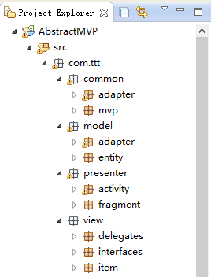
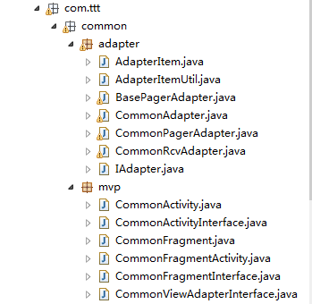

# AbstractMVP
A Android lightweight fully distributed MVP development model      [[中文文档]](https://github.com/GitSmark/AbstractMVP/blob/master/readme.md)

Features
------------
* Simple and convenient and practical
* Helps you separate your logic and keep your class clear and clear
* An innovative Android MVP development model from iOS

Important clause
----------------
* The files of package `com.ttt.common.mvp` are original artworks of [me](https://github.com/GitSmark/).
* The files of package `com.ttt.common.adapter` are derived from [tianzhijiexian/CommonAdapter](https://github.com/tianzhijiexian/CommonAdapter),thanks.

Sample Project
--------------
* The project structure by `Model - View - Presenter`



Usage
-----
1. Copy the files into your project.

  
  
 
2. Create your `ViewDelegate` and `ViewInterface`.
  
The Abstract ViewDelegate extents `CommonActivity`, `CommonFragment`, `CommonFragmentActivity` according to your need and add unimplemented methods, then implements ViewInterface that you want to done and realization.
  ```java
  public abstract class MainFragmentDelegate extends CommonFragment {
    // implements your ViewInterface and realization

  	@Override
  	public int inflateView() {
  		// TODO Auto-generated method stub
  		// return R.layout.fragment_main;
  	}
  
  	@Override
  	public void initView(View view) {
  		// TODO Auto-generated method stub
  		// initView view.findViewbyId(R.id.xx);
  	}
  
  	@Override
  	public void setListener() {
  		// TODO Auto-generated method stub
  		// setListener
  	}
  
  }
  ```
3. Use the following methods according to your need.
 - `BeforeCreate()` 
 - `AfterCreate()`
 - `getData()`
 - `Other()`

4. Add Listener if you need, then PresenterView extents ViewDelegate to handle events and your can implements `CommonViewAdapterInterface` to transmit adapter if you need.

   ```java
  public abstract class MainDelegate extends CommonActivity implements OnClickListener, OnItemClickListener, CommonViewAdapterInterface, MainInterface {
  
  	TextView tv;
  	ListView lv;
  	
  	@Override
  	public void initView() {
  		// TODO Auto-generated method stub
  		// setContentView(R.layout.activity_main);
  		// tv = (TextView) findViewById(R.id.textview);
  		// lv = (ListView) findViewById(R.id.listview);
  		// lv.setAdapter((BaseAdapter)getAdapter());
  	}
  	
  	@Override
  	public void setListener() {
  		// TODO Auto-generated method stub
  		// tv.setOnClickListener(this);
  		// lv.setOnItemClickListener(this);
  	}
  
  	@Override
  	public void setText() {
  		// TODO Auto-generated method stub
  		// tv.setText("Hello, AbstractMVP!");
  	}
  
  }
  ```
  ```java
  public class MainActivity extends MainDelegate {

  	private List<MainListEntity> datas = new ArrayList<>();
  	private MainListAdapter adapter = new MainListAdapter(datas);
  	
  	@Override
  	public Adapter getAdapter() {
  		// TODO Auto-generated method stub
  		// return adapter;
  	}
  	
  	@Override
  	public void onClick(View v) {
  		// TODO Auto-generated method stub
  		// setText();
  	}
  
  	@Override
  	public void onItemClick(AdapterView<?> arg0, View arg1, int arg2, long arg3) {
  		// TODO Auto-generated method stub
  		// Toast.makeText(this, datas.get(arg2).getName(), Toast.LENGTH_LONG).show();
  	}
  
  }
  ```

5.More usage of the `CommonAdapter` [get it](https://github.com/tianzhijiexian/CommonAdapter)

Customization
-------------------
  Customized yourself `Delegate` and `Interface`, you can easily customize whatever you want.
  
Sample
----------
  There is also a [sample](https://github.com/GitSmark/AbstractMVP/blob/master/AbstractMVPSample.zip) to get you started.

Contact
--------
  Have problem? Just [tweet me](https://twitter.com/huangxy) or [send me an email](mailto:huangxy8023@foxmail.com).

License
----------

    Copyright 2016 huangxy@GitSmark

    Licensed under the Apache License, Version 2.0 (the "License");
    you may not use this file except in compliance with the License.
    You may obtain a copy of the License at

       http://www.apache.org/licenses/LICENSE-2.0

    Unless required by applicable law or agreed to in writing, software
    distributed under the License is distributed on an "AS IS" BASIS,
    WITHOUT WARRANTIES OR CONDITIONS OF ANY KIND, either express or implied.
    See the License for the specific language governing permissions and
    limitations under the License.

