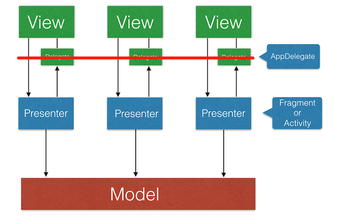

[](https://jitpack.io/#GitSmark/AbstractMVP)
[](https://opensource.org/licenses/Apache-2.0)

# AbstractMVP简介
AbstractMVP是一个为MVP架构实现提供抽象组件的库，且不存在传统androidMVP中的生命周期等问题。

MVP是模型(model)－视图(view)－呈现器(presenter)的缩写。  
`Model`：业务逻辑和数据处理(数据库存储操作，网络数据请求，复杂算法，耗时操作)。  
`View` : 对应于Activity，负责View的绘制以及与用户交互。  
`Presenter`：负责完成View于Model间的数据交互。

原理示意
-----


  
使用说明
-----
  
1. 本分支是在[主分支](https://github.com/GitSmark/AbstractMVP)的基础上加入支持了 `ViewBinding/DataBinding` 。

  首先，在项目的build.gradle文件中添加以下配置
  ```
  repositories {
      maven {
          url "https://jitpack.io"
      }
  }
  ```
  然后在app的build.gradle文件中添加以下配置
  ```
  android {
    buildFeatures {
        viewBinding = true
        //dataBinding = true
    }
  }
  //添加依赖
  implementation 'com.github.GitSmark:AbstractMVP:2.1.0-alpha-1'
  ```

  **特别说明**：推荐使用 `ViewBinding` + [ButterKnife](https://github.com/JakeWharton/butterknife)，简化代码，减少工作量的同时可以让View层更独立，并搭配使用[McAdapter](https://github.com/GitSmark/McAdapter)，实现可拔插多布局列表，支持item多处复用。
  
  AbstractMVP支持 `ViewController` 和 `ViewDelegate` 一对一，一对多，多对一，~~多对多~~，**降低耦合，代码复用，层级职责更明显，易于单元测试**，更多使用方法详见示例。

2. 使用 `Live Template` 快速生成对应文件，提高生产力，相关模板文件已封装好放在file/templates里面，欢迎下载使用，使用方法请自行百度。

Contact
--------
  Have problem? Just [tweet me](https://twitter.com/huangxy) or [send me an email](mailto:huangxy8023@foxmail.com).

License
----------

    Copyright 2016 huangxy@GitSmark

    Licensed under the Apache License, Version 2.0 (the "License");
    you may not use this file except in compliance with the License.
    You may obtain a copy of the License at

       http://www.apache.org/licenses/LICENSE-2.0

    Unless required by applicable law or agreed to in writing, software
    distributed under the License is distributed on an "AS IS" BASIS,
    WITHOUT WARRANTIES OR CONDITIONS OF ANY KIND, either express or implied.
    See the License for the specific language governing permissions and
    limitations under the License.

